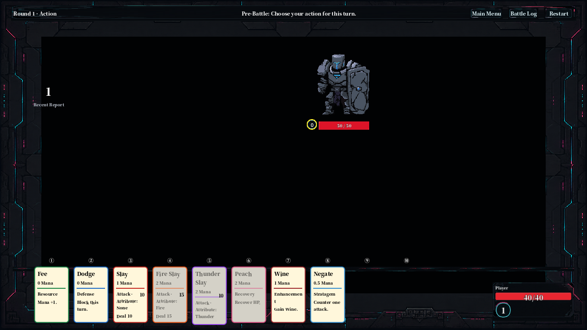
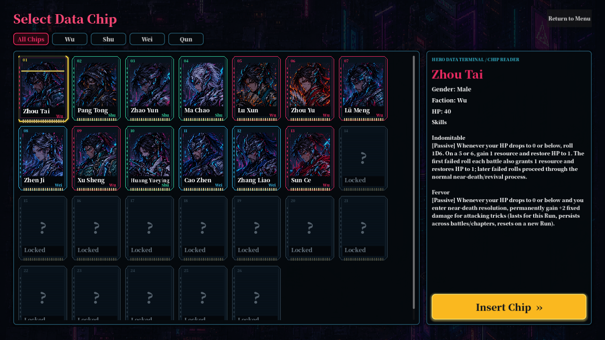
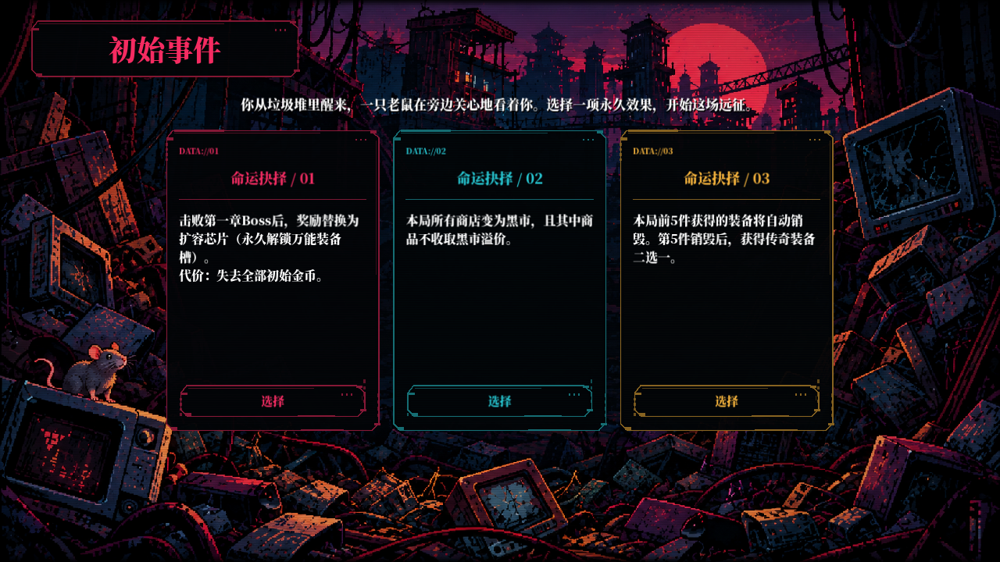

<h1 align="center">Forgotten Three Kingdoms</h1>

<p align="center">
  <strong>A strategy card roguelike featuring simultaneous card combat, character builds, equipment, skills, events, and branching progression.</strong>
</p>

<p align="center">
  
  
  
  
</p>

<p align="center">
  <a href="#play-the-game">Play the game</a> ·
  <a href="#technical-highlights">Technical highlights</a> ·
  <a href="#development-journey">Development journey</a> ·
  <a href="Docs/Engineering.md">Engineering notes</a>
</p>

> **Solo-developed in Godot and C#.** A ruined, cyberpunk vision of the Three Kingdoms where players choose a hero, make simultaneous card decisions, and assemble a run through skills, equipment, events, and boss encounters.

## Gameplay showcase

<p align="center">
  
  
</p>

<p align="center">
  
</p>

Every image above is an unretouched **English-language capture of a real Godot runtime screen**: the standard battle scene, hero selection, and the initial-event flow. No standalone background or concept art is used as a gameplay showcase. See [image provenance](Docs/Images/README.md).

## About the game

**Choose a character and faction → travel through branching nodes → fight enemies → obtain equipment, skills, buffs, and resources → develop a build → defeat bosses.**

The game replaces random hand draws with a fixed action-card bar. Every round, the player and enemies commit available actions, then resolve attacks, defenses, counters, healing, resource changes, and build effects through a shared combat pipeline.

## Core gameplay systems

| System | What is implemented |
| --- | --- |
| **Simultaneous card combat** | Both sides select actions before resolution. The combat rules support target selection, elemental attacks, defensive layers, counters, costs, and multi-enemy encounters. |
| **Fixed action cards** | Players use a visible action bar instead of drawing a random hand; the tactical layer comes from resources, matchups, timing, and build modifiers. |
| **Attack, defense, recovery, resources, counters** | The shared card system includes kill-family attacks, Dodge, Peach, Wine, Steal, Unassailable, and resource actions with distinct resolution rules. |
| **Characters, factions, skills, and equipment** | Hero-specific skills, faction effects, reaction choices, equipment triggers, chip bonuses, and statuses alter the same battle ruleset. |
| **Enemy AI** | State-aware, weighted decisions filter affordable cards and respond to HP, mana, status, action history, and encounter-specific rules. |
| **Events, shops, and progression** | Branching chapter maps, initial-fate choices, event conditions, reward choices, shop inventories, boss rewards, and four chapter definitions drive roguelike runs. |
| **Combat feedback and UI** | Damage previews, floating feedback, battle logs, reaction windows, bilingual UI, hero unlocks, codex content, and in-session return-to-menu/resume are integrated into the runtime. |

## Technical highlights

| Engineering focus | What I implemented |
| --- | --- |
| **Rule-driven battle resolution** | [`BattleResolver`](Scripts/Battle/BattleResolver.cs) coordinates action commitment, costs, defense preparation, counters, attacks, healing, resource effects, and per-target settlement. [`TriggerManager`](Scripts/TriggerManager.cs) collects effects by timing and executes them by priority so skills, equipment, and statuses share one ordered pipeline. |
| **Preview-safe damage calculations** | [`DamagePreviewService`](Scripts/DamagePreview/DamagePreviewService.cs) evaluates target-specific damage without running a live attack. [`DamageModifierPipeline`](Scripts/DamageModifier.cs) centralizes the order: additive bonuses first, then multipliers, reductions, and caps. |
| **Reusable reaction framework** | [`ReactionQueue`](Scripts/Reaction.cs), [`ReactionOption`](Scripts/Reaction.cs), and [`ReactionWindow`](Scripts/ReactionWindow.cs) provide a common timed response flow instead of one-off popups. Zhao Yun’s [`LongdanReaction`](Scripts/Reactions/LongdanReaction.cs) is one implementation on that framework. |
| **Data-driven enemy behavior** | [`EnemyDatabase`](Scripts/EnemyDatabase.cs), [`EnemyActionWeights`](Scripts/EnemyActionWeights.cs), and [`EnemyAI`](Scripts/EnemyAI.cs) separate enemy definitions from weighted decision evaluation. AI choices respect affordability and state rather than reading future player input. |
| **Run-content and reward pipeline** | [`RewardSystem`](Scripts/RewardSystem.cs), [`ChoiceProviders`](Scripts/ChoiceProviders.cs), [`EventDatabase`](Scripts/EventDatabase.cs), and [`ShopManager`](Scripts/ShopManager.cs) support reusable reward sequences, player choices, event outcomes, and shop content. |
| **Presentation and localization** | Effect presets and combat visual profiles are defined by ID, while [`Localization`](Scripts/Localization.cs) loads Simplified Chinese and English JSON tables with fallback behavior and change notifications. |
| **Focused regression scenes** | Godot test scenes cover card matchups, damage preview behavior, reactions, events, boss configurations, UI layout, and suspended-run restoration. Examples: [`DamagePreviewRegression`](Scripts/Tests/DamagePreviewRegression.cs), [`LongdanReactionDamageRegression`](Scripts/Tests/LongdanReactionDamageRegression.cs), and [`ContinueGameRegression`](Scripts/Tests/ContinueGameRegression.cs). |

For architectural decisions, trade-offs, and source-linked verification, see the recruiter-oriented [Engineering Notes](Docs/Engineering.md).

## My role

### Solo Developer

- Game design and balancing for cards, skills, equipment, enemies, rewards, events, and chapter progression.
- Gameplay programming in C# with Godot 4.6 .NET.
- Battle, trigger, reaction, damage-preview, AI, and run-progression system design.
- UI implementation for battle, map, shops, events, hero selection, logs, tooltips, and menus.
- Content/data implementation through C# databases and localized JSON text.
- Visual integration, art-pipeline coordination, testing, bug reproduction, and iteration with focused regression scenes.

Development includes AI-assisted coding and AI-generated visual assets. The repository documents their integrated use and provenance; it does not claim every visual was hand-drawn or every line of code was authored without assistance. See [menu layers](Assets/Backgrounds/MainMenu/README.md) and [generated boss-art notes](Assets/Bosses/BattlePortraits/Generated/README.md).

## Development journey

| Milestone | Portfolio-relevant progress |
| --- | --- |
| **v0.4.0 — combat, progression, and presentation pass** | Refined additive-then-multiplicative damage settlement, boss/AI behavior, equipment and event rewards, resume flow, menu/hero-selection UX, shop tooltips and chip choices, and Chapter 4 Cthulhu cyberpunk pixel-art portraits. [Read the update](Docs/Devlog/update-0.4.0.md). |
| **Visual foundations & character progression — “Update 2.0”** | Added effect presets, weapon/attack visual integration, map backgrounds, Zhao Yun portrait/full-body art, initial-event art, hero unlocks, and a Longdan reaction fix. [Read the update](Docs/Devlog/update-2.0.md). |
| **Combat and content iteration** | Expanded matchup rules, shields, elemental damage, enemy behavior, chapter content, equipment, events, rewards, UI, and localization. [Read the curated historical notes](Docs/Devlog/unversioned-updates.md). |
| **Current portfolio pass** | Consolidated the project into a recruiter-facing repository with source-linked engineering explanations, runtime UI captures, and focused regression evidence. [Browse all development records](Docs/Devlog/README.md). |

The supplied devlogs do not include verified release dates for every update; current behavior is described by the code and linked engineering notes rather than inferred from historical balance notes.

## Play the game

### itch.io build — **URL pending**

> Replace this placeholder with the public itch.io URL when the build is published.

Until then, run the project from source with **Godot 4.6.3 .NET** and the **.NET 8 SDK**:

```sh
git clone https://github.com/kk-uo/ftk.git
cd ftk
dotnet restore rouge3c.sln
dotnet build rouge3c.sln
```

Import `project.godot` in Godot’s .NET editor and press **F5**. The default viewport is `2560 × 1440` with Canvas Items / Expand scaling. The full setup and focused regression commands are in [Docs/DevelopmentGuide.md](Docs/DevelopmentGuide.md).

## Repository structure

| Directory | Purpose |
| --- | --- |
| [`Scripts/`](Scripts) | C# gameplay rules, combat, AI, UI controllers, presentation, tests, and run systems. |
| [`Scenes/`](Scenes) | Godot scenes for menus, battle, progression, UI, and focused regression tests. |
| [`Assets/`](Assets) | Character/enemy art, backgrounds, UI skin assets, weapons, audio, and asset notes. |
| [`Localization/`](Localization) | Simplified Chinese and English JSON localization tables. |
| [`Docs/`](Docs) | Engineering notes, development history, art pipeline references, and project documentation. |

## Contact & portfolio

- GitHub: [@kk-uo](https://github.com/kk-uo)
- Repository: [kk-uo/ftk](https://github.com/kk-uo/ftk)
- itch.io: **add public project URL when available**

---

<sub>Internal solution name: <code>rouge3c</code>. Current in-game branding: <strong>旧日三国 / Forgotten Three Kingdoms</strong>, v0.4.0.</sub>
